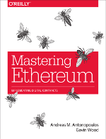

# Mastering Ethereum

 

Mastering Ethereum is a book for developers, offering a guide to the operation and use of the Ethereum, Ethereum Classic, RootStock \(RSK\) and other compatible EVM-based open blockchains.

This repository contains the draft of the book, currently in progress, scheduled for publication in Q4'2018 by O'Reilly Media. The publication date has been delayed, unfortunately, due to some personal issues. Expect to see content developed and pushed here in Q1 and Q2 2018.

## Content

The current status of the book is **CONTENT FREEZE - TECH REVIEW**. Only errors, fixes and typos will be accepted. Any new content submissions will be delayed for the second edition, which goes into production in late 2019 or early 2020.

Here's what is available now:

| Section | Progress | Content Complete |
| :--- | :--- | :---: |
| [Preface](https://github.com/bharatk101/ethereumbook/tree/96677b615b9a9a3f56c1ad6563769171140d7e4f/preface.asciidoc) | \#\#\#\# |  |
| [Glossary](https://github.com/bharatk101/ethereumbook/tree/96677b615b9a9a3f56c1ad6563769171140d7e4f/glossary.asciidoc) | \#\#\#\#\#\#\#\# | :heavy\_check\_mark: |
| [What is Ethereum](https://github.com/bharatk101/ethereumbook/tree/96677b615b9a9a3f56c1ad6563769171140d7e4f/what-is.asciidoc) | \#\#\#\#\#\#\#\#\# | :heavy\_check\_mark: |
| [Introduction](https://github.com/bharatk101/ethereumbook/tree/96677b615b9a9a3f56c1ad6563769171140d7e4f/intro.asciidoc) | \#\#\#\#\#\#\#\#\#\#\#\#\# | :heavy\_check\_mark: |
| [Ethereum Clients](https://github.com/bharatk101/ethereumbook/tree/96677b615b9a9a3f56c1ad6563769171140d7e4f/clients.asciidoc) | \#\#\#\#\#\#\#\#\#\# | :heavy\_check\_mark: |
| [Ethereum Testnets](https://github.com/bharatk101/ethereumbook/tree/96677b615b9a9a3f56c1ad6563769171140d7e4f/ethereum-testnets.asciidoc) | \#\#\#\# |  |
| [Keys and Addresses](https://github.com/bharatk101/ethereumbook/tree/96677b615b9a9a3f56c1ad6563769171140d7e4f/keys-addresses.asciidoc) | \#\#\#\#\#\#\#\#\#\#\#\#\# | :heavy\_check\_mark: |
| [Wallets](https://github.com/bharatk101/ethereumbook/tree/96677b615b9a9a3f56c1ad6563769171140d7e4f/wallets.asciidoc) | \#\#\#\#\#\#\#\#\#\#\# | :heavy\_check\_mark: |
| [Transactions](https://github.com/bharatk101/ethereumbook/tree/96677b615b9a9a3f56c1ad6563769171140d7e4f/transactions.asciidoc) | \#\#\#\#\#\#\#\#\#\#\#\#\#\#\# | :heavy\_check\_mark: |
| [Smart Contracts](https://github.com/bharatk101/ethereumbook/tree/96677b615b9a9a3f56c1ad6563769171140d7e4f/smart-contracts.asciidoc) | \#\#\#\#\#\#\#\#\#\#\#\#\#\#\#\#\#\#\#\#\#\#\#\#\#\# | :heavy\_check\_mark: |
| [Dev Tools and Frameworks](https://github.com/bharatk101/ethereumbook/tree/96677b615b9a9a3f56c1ad6563769171140d7e4f/dev-tools.asciidoc) | \#\#\#\#\#\#\#\#\#\# | :heavy\_check\_mark: |
| [Tokens](https://github.com/bharatk101/ethereumbook/tree/96677b615b9a9a3f56c1ad6563769171140d7e4f/tokens.asciidoc) | \#\#\#\#\#\#\#\#\#\#\#\#\#\#\#\#\#\#\# | :heavy\_check\_mark: |
| [DApps](https://github.com/bharatk101/ethereumbook/tree/96677b615b9a9a3f56c1ad6563769171140d7e4f/dapps.asciidoc) | \#\#\#\# |  |
| [Oracles](https://github.com/bharatk101/ethereumbook/tree/96677b615b9a9a3f56c1ad6563769171140d7e4f/oracles.asciidoc) | \#\#\#\#\#\#\# | :heavy\_check\_mark: |
| [Accounting & Gas](https://github.com/bharatk101/ethereumbook/tree/96677b615b9a9a3f56c1ad6563769171140d7e4f/gas.asciidoc) | \#\#\#\# | :heavy\_check\_mark: |
| [EVM](https://github.com/bharatk101/ethereumbook/tree/96677b615b9a9a3f56c1ad6563769171140d7e4f/evm.asciidoc) | \#\#\#\#\#\#\# | :heavy\_check\_mark: |
| [Consensus](https://github.com/bharatk101/ethereumbook/tree/96677b615b9a9a3f56c1ad6563769171140d7e4f/consensus.asciidoc) | \#\#\#\#\#\#\# | :heavy\_check\_mark: |
| [Vyper](https://github.com/bharatk101/ethereumbook/tree/96677b615b9a9a3f56c1ad6563769171140d7e4f/vyper.asciidoc) | \#\#\#\#\# | :heavy\_check\_mark: |
| [DevP2P Protocol](https://github.com/bharatk101/ethereumbook/tree/96677b615b9a9a3f56c1ad6563769171140d7e4f/devp2p-protocol.asciidoc) | \#\#\# | :heavy\_check\_mark: |
| [Ethereum Standards \(EIPs/ERCs\)](https://github.com/bharatk101/ethereumbook/tree/96677b615b9a9a3f56c1ad6563769171140d7e4f/standards-eip-erc.asciidoc) | \#\#\#\# | :heavy\_check\_mark: |
| [Forks History \(DAO/ETC\)](https://github.com/bharatk101/ethereumbook/tree/96677b615b9a9a3f56c1ad6563769171140d7e4f/forks-history.asciidoc) | \#\#\#\#\#\# | :heavy\_check\_mark: |

## Contributing, reviewing and commenting

This book is developed collaboratively and openly, here on GitHub. We accept comments, contributions and corrections from all.

You can chat with the authors and editors on [Gitter chat](https://gitter.im/ethereumbook/Lobby).

To contribute, see the detailed [Contributing Guide](contributing.md).

If you're new to new GitHub, you can watch the following video tutorial by Andreas M. Antonopoulos:

## Source and license

The book's source code, found in this repository, is kept synchronized with the print and ebook editions.

The [develop branch](https://github.com/ethereumbook/ethereumbook/tree/develop), containing the most recent changes you see here is the in-progress drafting of Mastering Ethereum.

Mastering Ethereum by [The Ethereum Book LLC and Gavin Wood](https://antonopoulos.com/) is licensed under a [Creative Commons Attribution-NonCommercial-NoDerivatives 4.0 International License](http://creativecommons.org/licenses/by-nc-nd/4.0/).

It is expected that the book will be released under a more permissive CC-BY-SA license within a year of publication.

